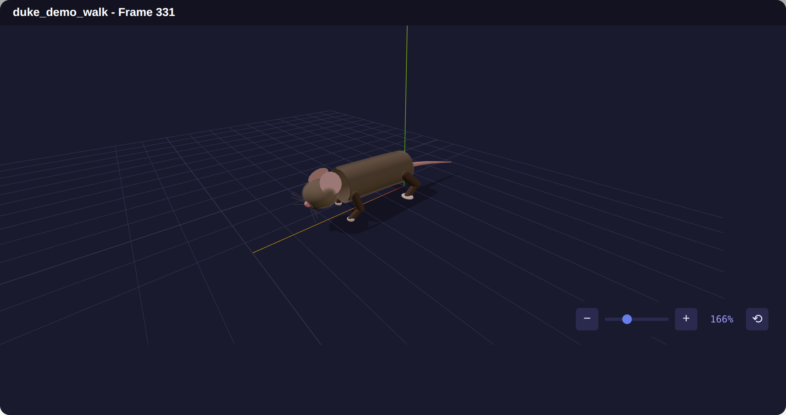
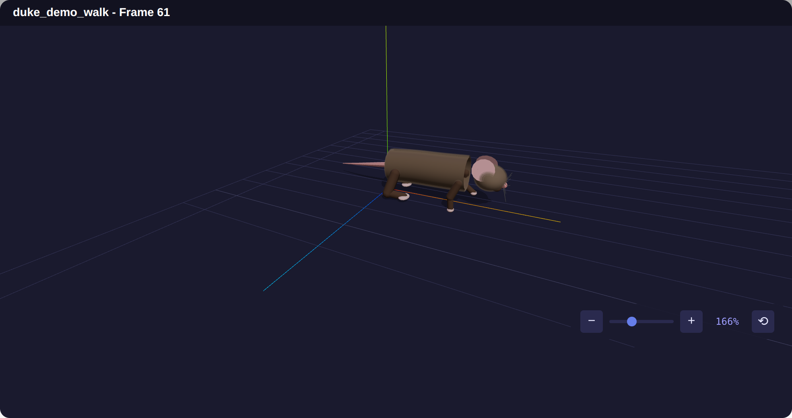
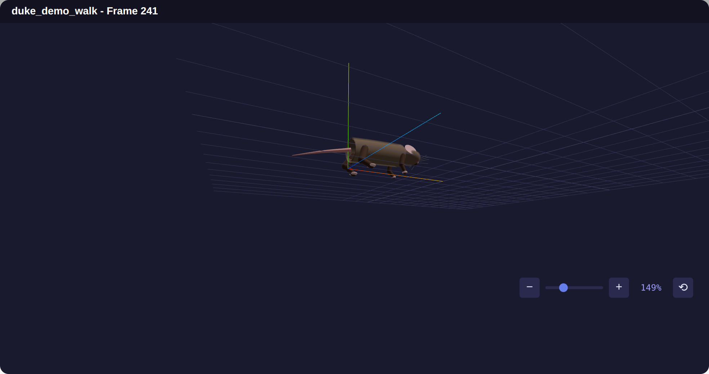
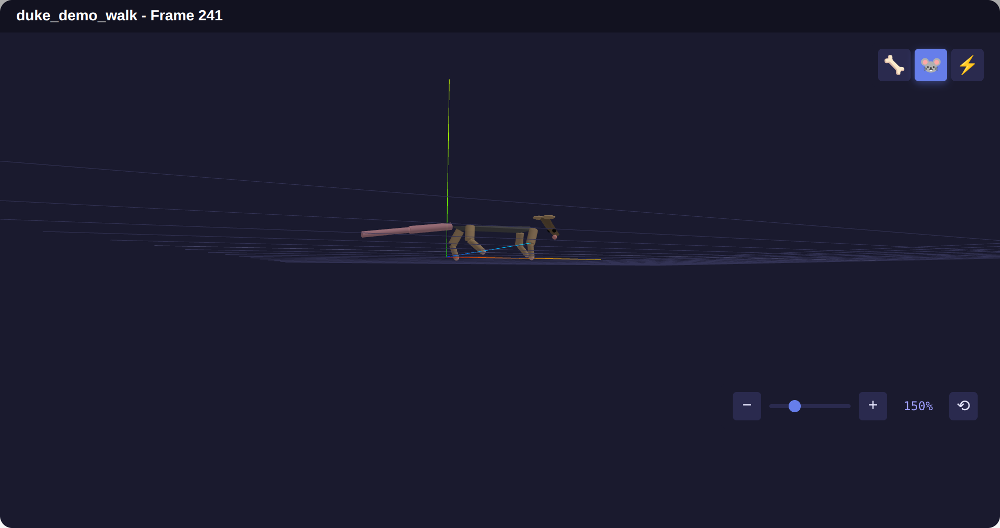

# VirtualRodent

Neural-to-pose prediction pipeline inspired by the Virtual Rodent paper. This project enables forecasting of 3D body pose trajectories from neural signals recorded in motor cortex and dorsolateral striatum (DLS).

## Overview

This project provides:
- **Data pipelines** for loading and preprocessing neural-pose paired data
- **PyTorch/Lightning datasets** for training neural decoding models
- **Interactive website** for visualizing neural signals and pose trajectories
- **Analysis tools** for exploring the relationship between neural activity and behavior

## Pose Animation Viewer

The interactive website renders recorded 3D pose keypoints as a fully animated
mouse in real time, using a Three.js scene with procedural geometry, 2-bone IK
limbs, fur shell texturing, spring-driven ears/tail/whiskers, blinking, and
foot-to-ground IK. Playback controls let you scrub, play, and adjust speed, and
you can orbit/zoom the camera freely.

<p align="center">
  
</p>

<p align="center">
  
  
</p>

A lighter **keypoint / skeleton** render mode is also available for inspecting
the raw joint structure:

<p align="center">
  
</p>

> The frames above were captured from the live viewer driven by a demo walking
> sequence. To explore real recordings, point the backend at your
> `data/Virtual_Rodent` directory and pick a session in the sidebar.

### Running the viewer

```bash
# 1. Start the Flask API (serves pose data from data/Virtual_Rodent)
python src/website/app.py            # http://localhost:5001

# 2. In another terminal, start the frontend
cd src/website/frontend
npm install
npm run dev                          # http://localhost:3000
```

Open http://localhost:3000, choose a session, load a range of frames, and
toggle between the 🐭 **Mouse Mesh** and 🦴 **Skeleton** render modes.

## Project Structure

```
VirtualRodent/
├── data/
│   └── Virtual_Rodent/          # Raw data from Virtual Rodent dataset
│       ├── DLS/                 # Dorsolateral striatum recordings
│       └── motor_cortex/        # Motor cortex recordings
├── docs/
│   └── ai/                      # AI-generated documentation
├── logs/                        # Training logs
├── notebooks/                   # Jupyter notebooks for analysis
├── outs/                        # Model outputs
├── scripts/                     # Utility scripts
└── src/
    ├── virtual_rodent/          # Main Python package
    │   └── data/                # Data loading and preprocessing
    ├── tests/                   # Unit tests
    └── website/                 # Interactive visualization app
```

## Installation

```bash
# Clone the repository
git clone https://github.com/adamcatto/VirtualRodent.git
cd VirtualRodent

# Create a virtual environment
python -m venv .venv
source .venv/bin/activate  # On Windows: .venv\Scripts\activate

# Install the package
pip install -e ".[dev,notebook,website]"
```

## Quick Start

```python
from virtual_rodent.data import VirtualRodentDataset

# Load the dataset
dataset = VirtualRodentDataset(
    data_dir="data/Virtual_Rodent",
    brain_region="motor_cortex",
    animal="duke"
)

# Get a sample
neural_signal, pose = dataset[0]
```

## Data

The dataset contains paired recordings of:
- **Neural signals**: Multi-unit activity from motor cortex and DLS
- **3D Pose**: Body keypoint positions tracked over time

Animals are named after jazz musicians: art, bud, coltrane (DLS) and duke, freddie, gerry (motor cortex).

## License

MIT License
